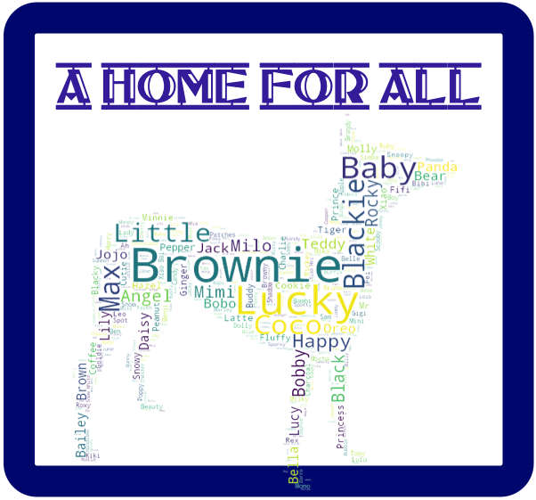
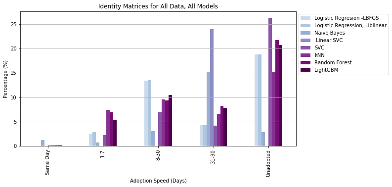

# **A Home for All**

## Overview
A local animal shelter has requested that a methodology be developed to help them more strategically process animals and ultimately improve adoption outcomes for their current residents. By leveraging the Kaggle Petfinder data and analyzing the trends between dog’s features and adoption outcome, a set of models were developed. These models can be used by the client to develop a specific strategy for each type of dog and ensure the funds needed to support an animal finding a home are best leveraged. These models revealed that it’s easy to predict which animals are adopted in under 90 days. Those animals that take longer to adopt can be sent to intensive training, or resituated with a better positioned rescue to ensure their placement in the correct “Fur-ever” Home.

This project has been broken into four sections, and the code for each section can be found at the following:
1. **[Data Wrangling:](https://github.com/CJEJansson/A-Home-for-All/blob/main/1.%20Data_Wrangling/Data_Wrangling.ipynb)** Downloading data, extracting features, creating features, data clean up
2. **[Data Storytelling:](https://github.com/CJEJansson/A-Home-for-All/blob/main/2.%20Data_Storytelling/Data_Storytelling.ipynb)** Analyzing graphically and statistically the impact of each feature on Adoption Speed.
3. **[Statistical Data Analysis:](https://github.com/CJEJansson/A-Home-for-All/blob/main/3.%20Statistical_Data_Analysis/Statistical_Data_Analysis.ipynb)** Analysing the statistical correlation between features of the dataset and Adoption Speed.
4. **[In Depth Analysis:](https://github.com/CJEJansson/A-Home-for-All/blob/main/4.%20In-Depth%20Analysis/In_Depth_Analysis.ipynb)** Application of machine learning techniques to predict adoption speed.

## Table of Contents
* [Getting Started](#GettingStarted)
  * Requirements
  * Libraries
* [The Data Set](#DataSet)
  * Files Used
  * Summary of Features
* [Project Sections](#ProjectSections)
  * [Data Wrangling](#DataWrangling)
  * [Data Storytelling](#EDA)
  * [Statistical Analysis](#Stats)
  * [In-Depth Analysis](#models)
    * [Model Summary](#ModelSummary)
      * Model Accuracy Scores
      * Model Results
  * [Recommendations to Client](#recs)
  * [Data Limitations](#limits)
  * [Opportunities for Future Work](#opps)
*[Acknowledgements](#Acknowledgements)

## Getting Started 
### Requirements

Viewing this project will require an installation of Juypyter Notebook or use of the [nbviewer](https://nbviewer.jupyter.org/) website. Running the code provided in this project will require Python v.3.7.1 and those libraries listed at the top of each notebook.

### Libraries
* For Data Wrangling
  * Numpy
  * Pandas
* For Data Storytelling
  * Numpy
  * Pandas
  * Matplotlib
  * Seaborn
  * os
  * wordcloud
  * PIL
  * functools.reduce
* Statistcal Data Analysis
  * Numpy
  * Pandas
  * Matplotlib
  * Seaborn
  * Scipy.stats
  * pylab.savefig
* For In-Depth Analysis

## The Data Set
The data is provided from the Kaggle.com PetFinder competition, targeted at increasing adoption speeds for homeless pets. It’s divided into a test and train dataset and contains information on over 10,000 animals, including cats and dogs.

It can be downloaded [here](https://www.kaggle.com/c/petfinder-adoption-prediction/data)

The data is pulled from the Malaysian region, and is categorized by Malaysian state. Feature data is a combination of ordinal features and descriptive fields (name, description of animal). Those fields that have been converted to an ordinal format have separated descriptive data in an independent table for each feature.  For this project, only the data pertaining to dogs was utilized. A brief overview of the types of data and the features classifying each dog can be seen in the image below: 

## Project Sections

### Data Wrangling
Complete code for the data wrangling portion of this project can be found [here](https://github.com/CJEJansson/A-Home-for-All/blob/main/1.%20Data_Wrangling/Data_Wrangling.ipynb).

The approach for data wrangling was as follows:
1. Review the available files:
  * For Kaggle Dataset: Will be using the files “test.csv” and “train.csv” as well as all the tables for breed labels, color labels, and state labels.
  * Overall the Kaggle dataset is very clean, which is not unexpected.
2. Examine the “test’ dataset.
  * Found null values in the “names” and “description” columns, both of which make sense. Cursory examination of the data showed no outliers or unexpected values.
  * Created an extra column “adoption speed” and filled will nulls to allow for combination with “train” dataset.
3. Examine the “train” data
  * Similar null values, in name and description. Leave these as nulls.
4. Combine the datasets, drop the cat specific data and only keep dog specific data.
  * Notice that the null values for Name are now missing.
  * Go back and correct them by identifying that they’ve been converted to “No Description”.
  * Further examination of the name column reveals several “please name me”, “unnamed”, etc. Word clouds during EDA would yield more information and allow for a potentially more effective replacement string. However, further investigation shows a large number of names that are not actually names. Pulled data into excel and manually cleaned entirety of name column.
  * Description column is in a similar state. Anything that is just a string of characters and not an actual description manually cleaned out via excel.
5. Examine the breed columns. Notice that there are several blank values.
  * Create a “no breed” value and assign it to zero.
  * Fill null breeds with zero value.
  * Create a column for “breed count” to distinguish between mixed/pure breed dogs.

### Data Storytelling

Complete code for the data storytelling and exploratory data analysis portion of this project can be found [here](https://github.com/CJEJansson/A-Home-for-All/blob/main/2.%20Data_Storytelling/Data_Storytelling.ipynb)

There are listings for 10,230 dogs in the provided dataset. These dogs are located in the country of Malaysia and are available for adoption via the PetFinder website. It is known from animal rescue work in the United States that dogs with the least likely chance of adoption are senior dogs, dogs with health problems, and dogs that have black fur. Also, the breeds categorized as “aggressive,” pitbull breeds, german shepherds, dobermans, etc. have a lower chance of adoption. Overall, approximately 50% of American animals (approximately 1.2 million) go unadopted, annually. It is suspected that this is also the case in dog rescue globally.

When looking at the Kaggle dataset it quickly becomes apparent that a large number of dogs are also going unadopted, but not to the severity in the U.S. Approximately 30% of dogs go either unadopted or unreported as being adopted. As expected, a very low number of dogs are adopted on the same day they are listed, at 2.08% Of these animals, the younger dogs are adopted more quickly than the senior, which is consistent with expectations.

When it comes to names and appearance, dogs that have already been given a name tend to be adopted more quickly in the U.S. It’s possible that the presence of a name indicates the dog’s history is known, and it gives a sense of personality. When analyzing the Kaggle data there was no apparent relationship between name and adoption speed, with unnamed and named dogs being adopted at approximately the same speed. In the data set the most common names given to dogs are related to the color of the animal, with “Blackie” and “Brownie” being the most popular.

When it comes to breed choices in the U.S., purebred dogs tend to be more popular. Particularly when it comes to labradors and other hunting dogs. The data set demonstrates that in Malaysia this is not the case, with mixed breed dogs being more popular. This may be due to the availability of mixed breed dogs, people will take what’s available. However, Labrador’s are just as popular as they are here in the U.S.  Shih Tzu’s and Terriers are the second and third most popular dogs.  The size of the dog also plays a role here in the U.S., with medium size breeds being more popular. In Malaysia, giant breeds are very quickly adopted, likely due to their scarcity, as they make up 0.22% of the data set. Otherwise, size has very little effect on adoption speed in Malaysia.

When it comes to appearance, in the U.S., there’s definitely an impact. While fur length doesn’t make much of a difference in the dog’s adoption speed, the color does. There’s a well known phenomenon in the U.S. adoption groups that indicates black, or darker colored dogs go largely unadopted. This is thought to be because they appear intimidating, and they also do not photograph well. In Malaysia fur length also has very little effect on adoption speed. However, as expected, darker color dogs go unadopted more often. This may in part be due to the large number of dark colored dogs that are available. Additional investigation would be needed for conclusive evidence, but it appears the trend holds. One interesting observation of note is that golden colored dogs and yellow colored dogs are separated into two groups. At first glance it appears that yellow dogs are also very unlikely to be adopted, but when combined with golden dogs this trend disappears. It appears classification when setting up a pet’s profile matters!

As with dogs in the U.S., the way the listing profile is set up has an effect on the speed with which an animal will be adopted. The presence of photos and as much information as possible does make a noticeable difference here. Also, the more dogs per listing the less likely you are to see an adoption. This trend holds true in Malaysia. Also of note, the presence of a video makes little difference in adoption speed, and whether a dog is free or not has little impact. It’s possible that listings with larger numbers of dogs that do not require co-adoption (for litters vs adopting siblings together) are obscured because there is no way to record adoption speed for each animal, and the longest adoption time is all that’s captured.

In the U.S. the health of an animal plays a large role in adoption speed. To the point that almost all shelters and rescues guarantee the dog will be sterilized (spayed/neutered), up to date on vaccinations, and dewormed. Healthy dogs also tend to be adopted faster as opposed to those classified as “special needs”, or those dogs that have a known injury or illness. In the dataset it became apparent that dogs that were unsterilized, not dewormed, and unvaccinated were fastest adopted. More in depth investigation showed that this is because these dogs were typically puppies, and puppies are adopted fastest. After removing puppies from the data set the trends more closely mirrored those in the U.S. As expected, dogs that are unhealthy or have a known injury/illness are less likely to be adopted.

Overall the data showed the results expected with a few exceptions. Malysian dog trends are slightly different than those in the U.S. As expected those dogs with the worst outlook for adoption are dark colored, seniors, or dogs with health issues. A few unexpected gems were unearthed as part of this EDA, including the insignificance of videos, the impact of age on other variables, and the preference for an unsterilized dog. Hopefully these insights will lend themselves to the development of an accurate adoption prediction engine in later projects.

### Statistical Data Analysis
Complete code for the statistical analysis portion of this project can be found [here](https://github.com/CJEJansson/A-Home-for-All/blob/main/3.%20Statistical_Data_Analysis/Statistical_Data_Analysis.ipynb).

All results of this investigation are summarized in Appendix A in tabular format. All hypothesis tests were performed using the Chi-squared test for independence with an alpha value of 0.05. Hypotheses tested and corresponding results were as follows:

1. **Adoption speed is independent of life stage (age):** We expect from EDA that life stage and adoption speed are dependent.
  * Hypothesis testing shows that these features are dependent.
2. **Adoption speed is independent of name:** We expect that name has no impact on adoption speed.
  * Hypothesis testing shows that the dog having a name impacts adoption speed, but the actual name is independent of adoption speed.
3. **Adoption speed is independent of breed:** We expect that breed has some impact.
  * Testing shows that there is a relationship between both breed type and mixed vs purebred dogs and adoption speed. There is more correlation between mixed/purebred and adoption speed, but more significance in the relationship between adoption speed and breed.
4. **Adoption speed is independent of size:** We expect that size has some impact on adoption speed.
  * Testing shows that there is, as expected, a relationship between adoption speed and size.
5. **Adoption speed is independent of fur length:** We expect that there is no relationship between adoption speed and fur length.
  * Testing shows that there is an unexpected relationship between fur length and adoption speed. Correlation suggests longer fur leads to an animal being less likely to be adopted.
6. **Adoption speed is independent of color:** We expect that color has some impact on adoption speed.
  * Testing shows that there is a relationship between color and adoption speed, and it is stronger than the relationship between the number of colors and adoption, as expected.
7. **Adoption speed is independent of the number of photos:** We expect that photos have some impact but there are diminishing returns after 2. However, we'll be testing whether they matter or not as part of hypothesis testing.
  * Testing showed that there is a relationship between the number of photos and adoption speed. Test results in this instance may be somewhat unreliable due to the number of photos being a continuous variable rather than discrete.
8. **Adoption speed is not faster if there are videos:** We expect there is no relationship between videos and adoption speed
  * As expected, videos and adoption speed were revealed to be independent.
9. **Adoption speed is independent of vaccination:** We expect that there is some impact on adoption speed if the animal is vaccinated.
  * Test results show that there is some dependence. As expected, correlation also showed there’s a relationship between vaccination and age.
10. **Adoption speed is independent of sterilization:** We expect that there is some impact on adoption speed if the animal is sterilized
  * There is a relationship between sterilization and adoption speed. Again there is a larger correlation between sterilization and age.
11. **Adoption speed is independent of worming status:** We expect that there is some impact on adoption speed if the animal is dewormed.
  * There is a relationship between worm status and adoption speed, but there is more correlation between worm status and animal age.
12. **Adoption speed is independent of health status:** We expect that there is an impact on adoption speed if the animal is healthy
   * There is a relationship between health status (whether the animal has a preexisting condition) and adoption speed. Again, the correlation is more relevant between this feature and age.
13. **Adoption speed is independent of cost:** We expect that there is no impact on adoption speed with cost.
  * There is a relationship between adoption speed and cost. Correlation indicates that those animals with a fee may actually be adopted more quickly.

The result of the Cramer’s V analysis showed that none of the features studied have a large impact on the adoption speed of an animal when compared individually. Additional investigation will be needed to analyze the inter-feature relationships, likely via machine learning. A copy of the final heat map generated using the Cramer’s V method can be seen below:

### In-Depth Analysis
Complete code for the machine learning portion of this project can be found [here](https://github.com/CJEJansson/A-Home-for-All/blob/main/4.%20In-Depth%20Analysis/In_Depth_Analysis.ipynb).

It was anticipated prior to beginning analysis that the model would have difficulty predicting same day adoptions as this is generally difficult to predict in a real life setting. The majority of the data chosen was categorical or non-continuous data, so that limited the model choices somewhat.

The first step involved converting some of the features to ordinal classes, to allow for application of specific models and eliminate difficulty of analyzing datasets with mixed data. The two variables specifically targeted were Name and Rescuer ID. Name was converted into a binary presence/absence, and Resucer ID was converted into randomly unique integers by ID. Then all data that was not going to be used was dropped, which included that data that was either converted or would be non-useful in analysis. This included the features Name (converted), Rescuer ID (converted), the index column, randomly assigned Pet ID, and the description, which was not used in this analysis.

Then the data was split using training, testing, and validation sets. The first split was done to segregate 10% of the data for later model validation. The remaining data was split into 75% training, 25% test sets, and stratified using the Adoption Speed feature. Stratification was chosen to handle the amount of imbalance between categories.

Models analyzed include: Logistic regression, Naive Bayes, Support Vector Machines(SVM)- both linear and nonlinear, K-Nearest Neighbors (kNN), Random Forest, and LightGBM.

#### Model Summary

#####  Model Accuracy Scores 
Typically, these model scores would leave room for improvement. It bears noting that the first place model on the leaderboard had an accuracy score of 0.45338. A summary of the model performance can be seen below:

#####  Model Results
A summary of each model’s accuracy was created by pulling only the True-Positive classifications out of the identity matrix and plotting them side by side. This summary was found to be most useful when eliminating data from the models for those pets that were adopted on the same day, due to the randomness of this event. However, a summary plot of accuracy for each prediction by model when studying all animals can be seen in Appendix A. The summary chart for only animals who were not adopted on the same day as being listed can be seen in the figure below.

### Recommendations to the Client
The Model Results shown above were utilized to make the following recommendations to the client:
* The best chance of predicting a same day adoption is to use the logistic regression model using a liblinear solver.
* The second step in analyzing a new pet during intake should be to  run LinearSVC, and keep those pets who will be adopted in the first month if capacity is available.
* To determine those pets who will require a more medium duration stays (<90 days), utilize the Naive Bayes model
* To predict those pets who will require long term care, and possibly rehoming to a more targeted rescue, specialized training, etc. utilize the following models: SVC, kNN, Random Forest, or Light GBM.
* An averaged prediction for all models can also be utilized.

### Limitations of the Dataset
While the dataset does a good job of providing examples for PetFinder listings, and a lot of work has been done to investigate how to improve prediction of adoption speed based on a listing, there are some points about the data that are lacking in clarity. They include, but are not limited to the following:
* Understanding interactions between listings opening and closure- how is “adoption speed” defined. Are animals that go unadopted simply not updated listings?
* Understanding how unique identifiers are assigned - is it possible for a pet to change rescues and have multiple listings for the same animal with different outcomes?
* Understanding how breed is determined for listings - is it appearance based or DNA based?

### Opportunities for Future Work
This project is as comprehensive as possible, given the constraints. However, there are additional opportunities to expand on this work, including, but not limited to:
* Exploring the effect of specific names on adoption speeds
* Exploring the effect of description on adoption speeds
* Exploring the appearance of pictures and their effect on adoption speed, particularly since some relationship was indicated between photos/adoption speed
* Understanding animal trends in other countries and being able to compare relationships between the data set analyzed here and local trends
* Exploring the relationship between specific breeds and adoption speeds to uncover bias
* Exploring the relationship between animal size/color and any unintended bias in adopter response
* Examining breed/size restrictions in different states and correlating to uncover additional trends
* Developing an effective algorithm to process the “name” feature of the data and clean it, rather than cleaning manually, and repeat the analysis
* Perform a data cleaning on the entire dataset, and repeat analysis to determine accuracy of the models without using description or photo analysis.
* Exploring housing and other socioeconomic trends in the area surrounding each rescue to determine those effects on adoption speed.
* Development of a targeted recommender style adoption speed predictor system to predict adoption speed and provide a recommended course of action. This model could be further developed by analyzing the rescue specific data, and data of those rescues in the surrounding area. The data could then be used to include recommendations for more target-appropriate rescues to send difficult-to-home pets that may succeed better if placed with a different rescue.

## Author 

* **Caitlin Jansson** - *Initial work* - [A Home For All](https://github.com/CJEJansson/A-Home-for-All)

##  Acknowledgments 

* https://towardsdatascience.com/the-search-for-categorical-correlation-a1cf7f1888c9
* https://www.aspca.org/animal-homelessness/shelter-intake-and-surrender/pet-statistics
* https://www.kaggle.com/c/petfinder-adoption-prediction/discussion/81597
* Special thanks to Kenneth Gil-Pasquel for support, guidance, and input on this project.
