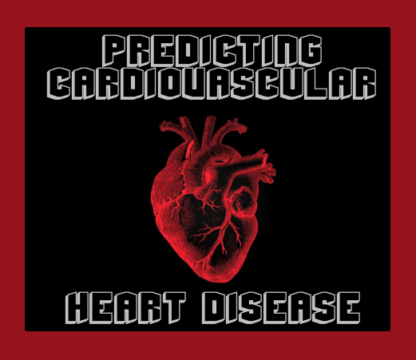
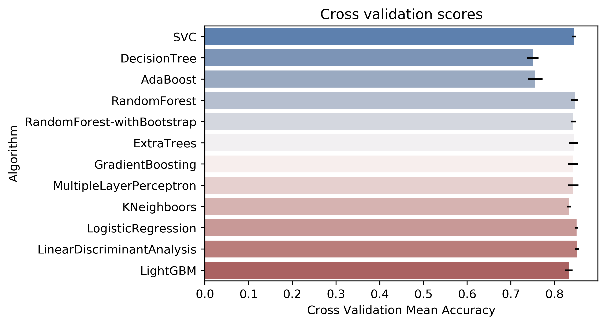
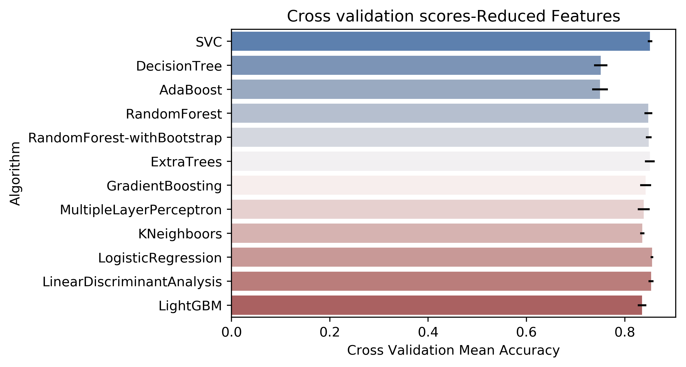
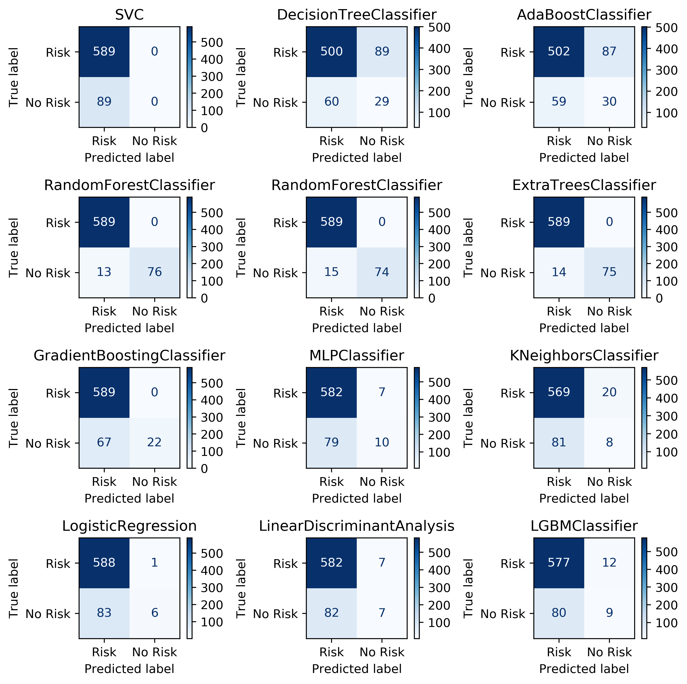
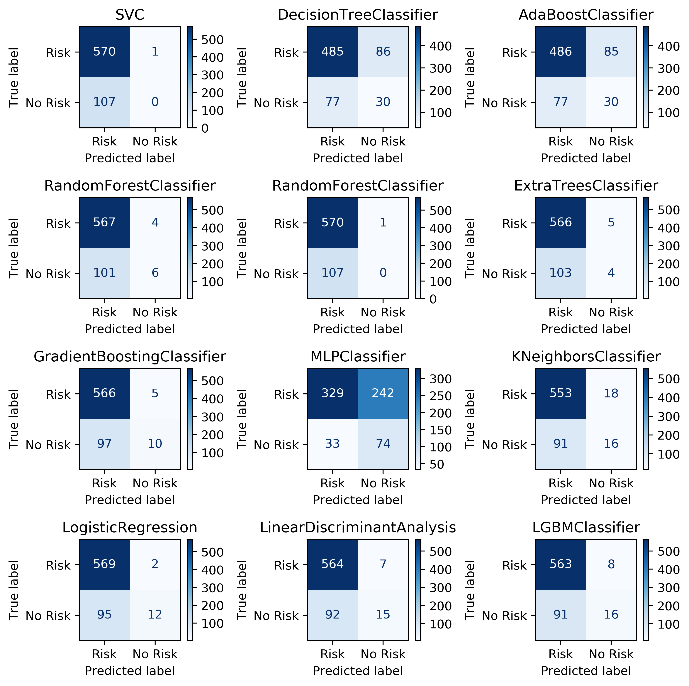

# **Predicting Cardiovascular Heart Disease**

## Overview
Cardiovascular heart disease (CHD) is the leading cause of death annually worldwide. Cardiovascular diseases can, however, be managed if caught early and simple lifestyle changes are made. This project explores a set of data for patients measuring known factors for heart disease to develop a machine learning model to predict risk of developing heart disease within the next ten years.

The project has been broken into two sections, and the code for each section can be found at the following:
1. **[Data Wrangling, Storytelling, and Statistical Analysis](https://github.com/CJEJansson/Springboard_Projects/blob/master/Predicting%20Cardivascular%20Heart%20Disease/Predicting%20CHD%20-%20In-Depth%20Analysis.ipynb)** Downloading data, extracting features, creating features, data clean up. Analyzing graphically and statistically the impact of each feature on the risk of developing CHD in the next 10 years. Analysing the statistical correlation between features of the dataset and the risk of developing CHD in the next 10 years.
2. **[In-Depth Analysis](https://github.com/CJEJansson/Springboard_Projects/blob/master/Predicting%20Cardivascular%20Heart%20Disease/Predicting%20Cardiovascular%20Disease.ipynb)** Application of machine learning techniques to predict adoption speed.

**See the full project, including project-specific readme file, [here](https://github.com/CJEJansson/Springboard_Projects/tree/master/Predicting%20Cardivascular%20Heart%20Disease)**

Additional detail can be found in the [final report](https://github.com/CJEJansson/Springboard_Projects/blob/master/Predicting%20Cardivascular%20Heart%20Disease/Reports/Predicting%20Cardiovascular%20Heart%20Disease.pdf) or [presentation](https://github.com/CJEJansson/Springboard_Projects/blob/master/Predicting%20Cardivascular%20Heart%20Disease/Presentations/Predicting%20Cardiovascular%20Heart%20Disease%20-%20Final%20Presentation.pdf) for this project.

A brief overview of the results can be found below.

## **Table of Contents**
* [Getting Started](#GettingStarted)
  * *Requirements*
  * *Libraries*
* [The Data Set](#DataSet)
* [Project Sections](#ProjectSections)
  * [Data Wrangling, EDA, and Statistical Analysis](#DataEDA)
  * [In-Depth Analysis via Machine Learning](#models)
    * *Data formatting*
    * [Model Summary](#ModelSummary)
      * Model Accuracy Scores
      * Confusion Matrices for both Analyses
*[Acknowledgements](#Acknowledgements)

## **Getting Started** 
### *Requirements*

Viewing this project will require an installation of Juypyter Notebook or use of the [nbviewer](https://nbviewer.jupyter.org/) website. Running the code provided in this project will require Python v.3.7.1 and those libraries listed at the top of each notebook.

### *Libraries*
* For Data Wrangling, Data Storytelling, and Statistical Data Analysis
  * Numpy - v. 1.192
  * Pandas - v. 1.1.3
  * Matplotlib- v. 2.2.4
  * Seaborn- v.0.9.0
  * Scipy.stats- v. 1.5.2

* For In-Depth Analysis
  * SkikitLearn - v. 0.24.1
  * imblearn - v.0.8.0
  * LightGBM - v. 2.3.0

  
  ## The Data Set
  The data is provided from the Kaggle.com HME Workshop on Oct 3, 2020  targeted at increasing prediction of risk of developing CHD within the next ten years. This dataset is a subset of the Framingham, MA heart study data set.

  The data can be found [here](https://www.kaggle.com/christofel04/cardiovascular-study-dataset-predict-heart-disea).

  
  ## Project Sections
  The project is broken into two sections. The first includes cleaning the data, performing exploratory data analysis, and statistical analysis. The second involved in-depth analysis by utilizing various Machine Learning techniques to build a predictive model.

  
  ### Data Wrangling, EDA, and Statistical Analysis
  The data was relatively clean, due to the nature of the dataset. Additional clearning was performed during in-depth anaylysis, which is explained further [below](#models).

  Exploratory data anlysis confirmed the findings of the Framingham Heart Study. The risk of devleoping CHD increases with the following:
  * Smoking
  * High Cholesterol
  * High blood pressure
  * Prevalence of Stroke
  * Prevalence of Hypertension
  * Diabetes (and blood sugar).

  These findings were summarized using various graphs which can be seen in either the [images](https://github.com/CJEJansson/Springboard_Projects/tree/master/Predicting%20Cardivascular%20Heart%20Disease/images) repository or in the [project code](https://github.com/CJEJansson/Springboard_Projects/blob/master/Predicting%20Cardivascular%20Heart%20Disease/Predicting%20Cardiovascular%20Disease.ipynb).

  
  ### In-Depth Analysis via Machine Learning
  After completion of Exploratory Data Analysis (EDA) and Statistical Analysis, a more in-depth analysis was started by developing several Machine Learning Models.

#### *Data Formatting*

  To prepare the data for application of Machine Learning models, the data had to be adjusted to fill null values in all features other than the target variable, in this case TenYearCHD.  This was done differently than in the EDA section, to allow for the application of certain models by converting all values to ordinal categorical and by “removing” null values. The combined test and train data was preprocessed by performing the following steps:

    * Both gender and smoking status were converted to ordinal values, consistent with the rest of the data set. Values were assigned to Male/Female as 0/1, and Non-smoker/Smoker as 0/1.
    * Null values for education were filled with a 5, to correspond to other values 1-4
    * Null values for BP meds were filled with a  2, to correspond to No-0, Yes-1
    * Null values in the number of cigarettes per day, total cholesterol, BMI,  heart rate, and glucose (blood sugar) were filled with the median value calculated from non-nulls.
    * Split the data back into the original train/test datasets where “train” is populated using entries with non-null target values, and “test” contains null values for TenYearCHD.

The train data was used to conduct the entirety of the analysis for this project, due to the presence of values in the target variable. Analysis was conducted in two ways, first by splitting on the variable “is_smoking”, since that was the most balanced variable in the dataset. Data was split into train/test, saving 20% of the data for testing. Several models were then run on this data.  As a second analysis, the results of the LightGBM feature selection (Appendix B) were used to remove the 2 least significant features is_smoking and prevalent_stroke, and analyzing the data, again using an 80/20 split.

### Model Summary
Models were scored using accuracy, f1-score, cross-validation accuracy, and by resulting confusion matrices.
Ultimately confusion matrcies were used to recommend treatment plans for each patient and show best model performance.

The primary metric for model success was lest number of at risk patients categorized incorrectly, followed by least number of not at risk patients categorized incorrectly.

A summary of the cross-validation accuracy scores for both sets of features and the confusion matrices for both sets of features can be seen below.

#### Model Accuracy Scores

*All Features*

*Reduced Features*

#### Model Confusion Matrices

*All Features*

*Reduced Features*

## Author

* **Caitlin Jansson** - August 8th, 2021

## Acknowledgments 

  * https://www.thelancet.com/journals/lancet/article/PIIS0140-6736%2813%2961752-3/fulltext
  * https://web.archive.org/web/20170710152157/https://www.framinghamheartstudy.org/index.php
  * https://machinelearningmastery.com/a-tour-of-machine-learning-algorithms/
  * https://scikit-learn.org/stable/modules/classes.html#module-sklearn.metrics
  * https://towardsdatascience.com/cross-validation-430d9a5fee22

* Special thanks to Kenneth Gil-Pasquel for support, guidance, and input on this project.
